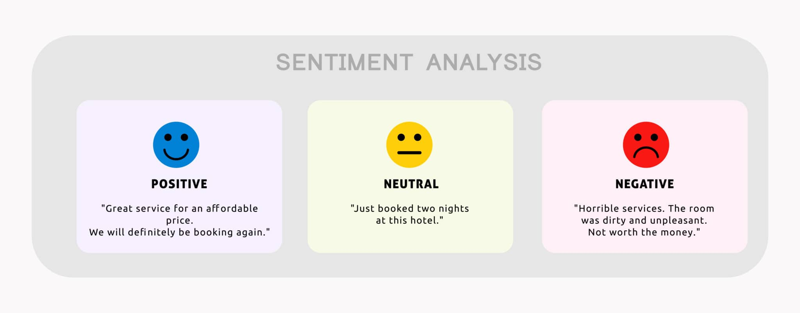
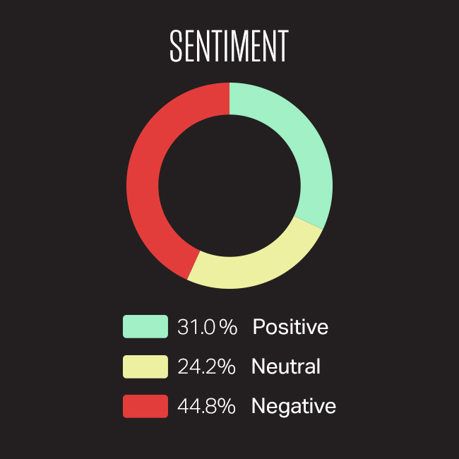
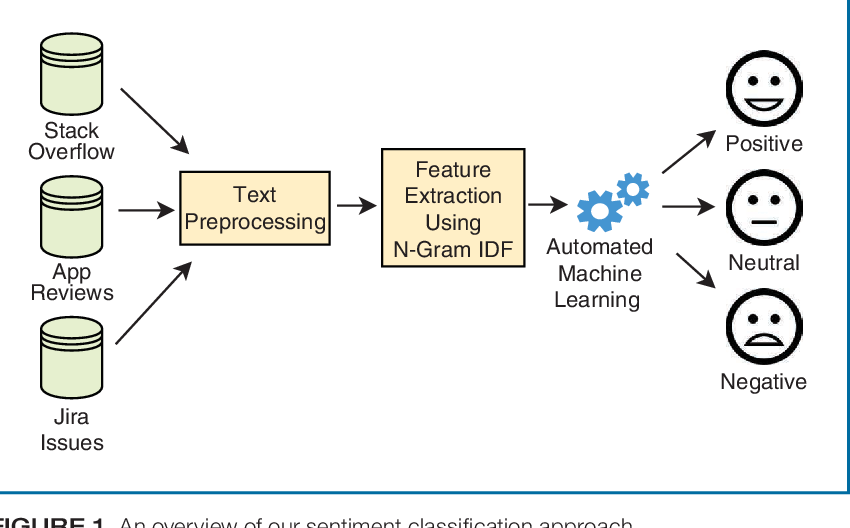
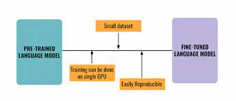
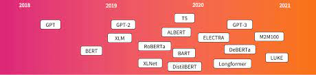
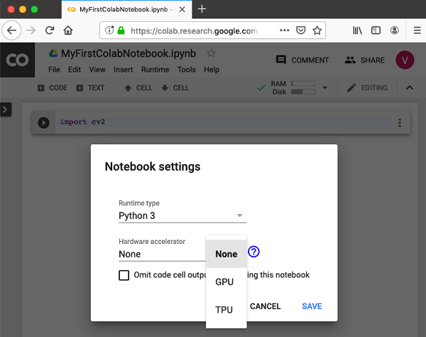
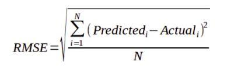

# 💉💉💉 Vaccination Sentiment Analysis 💉💉💉


This project focuses on developing a machine learning model to assess the sentiment (positive, neutral, or negative) of Twitter posts related to vaccinations. 

<p align="center">
  
</p>

This is my submission for Zindi's challenge [To Vaccinate or Not to Vaccinate: It’s not a Question by #ZindiWeekendz](https://zindi.africa/competitions/to-vaccinate-or-not-to-vaccinate).

[](https://www.crowdbreaks.org/)


## Dataset

- The dataset consists of tweets collected and classified through Crowdbreaks.org.
- Tweets have been labeled as positive (👍), neutral (🤐), or negative(👎).
- Usernames and web addresses have been removed for privacy reasons.

## Objective

- The main goal is to build a machine learning model that can accurately predict the sentiment of vaccination-related tweets. Something similar to this; 

<p align="center">
  
</p>

## How to Participate

- Access the dataset from Crowdbreaks.org by following the dataset link.
- Use the labeled tweets as training data to develop your machine learning model.
- Evaluate the model's performance and make predictions on new/unseen data.
- Share your approach, code, and results on the Zindi platform to participate in the challenge.

Files available for download are:

**Train.csv** - Labelled tweets on which to train your model

**Test.csv** - Tweets that you must classify using your trained model

**SampleSubmission.csv** - is an example of what your submission file should look like. The order of the rows does not matter, but the names of the ID must be correct. Values in the 'label' column should range between -1 and 1.

**NLP_Primer_twitter_challenge.ipynb** - is a starter notebook to help you make your first submission on this challenge.

The train dataset consist of the following features 

**Variable definition:**

| Feature    | Meaning                                                                               |
|------------|---------------------------------------------------------------------------------------|
| tweet_id   | Unique identifier of the tweet                                                       |
| safe_tweet | Text contained in the tweet. Sensitive information (usernames, URLs) removed          |
| label      | Sentiment of the tweet (-1 for negative, 0 for neutral, 1 for positive)               |
| agreement  | Percentage of agreement among the three reviewers for the given label                 |


## Modelling  

<p align="center">
  
</p>

### Pre-trained Models and Fine-tuning

<p align="center">
  
</p>

- Utilized pre-trained models from the Hugging Face library for Natural Language Processing (NLP) tasks.

<p align="center">
  
</p>

- Models used: 
  - ROBERTA: "Abubakari/finetuned-Sentiment-classfication-ROBERTA-model"
  - BERT: "Abubakari/finetuned-Sentiment-classfication-BERT-model"
  - DISTILBERT: "Abubakari/finetuned-Sentiment-classfication-DISTILBERT-model"

- Models have been fine-tuned on sentiment classification, suitable for analyzing sentiment in vaccination-related tweets.

- Leveraged pre-trained models' contextual understanding of language and ability to extract meaningful representations from text.

- During the modeling process, the selected model was loaded based on the user's choice using the corresponding identifier from the Hugging Face library.

- Performed parameter tuning and fine-tuning to optimize the performance of the selected models.

- Adjusted hyperparameters (learning rate, batch size, epochs) to achieve the best results.

- Goal: Accurately classify tweets into positive, neutral, or negative sentiment categories related to COVID-19 vaccinations.

### GPU Acceleration with Google Colab

<p align="center">
  
</p>

- Utilized GPUs (Graphics Processing Units) for enhanced performance and faster model training.

- GPUs are efficient in handling parallel computations, accelerating deep learning tasks.

- Leveraged Google Colab with free GPU resources for efficient model training and evaluation.

- Google Colab provided a cost-effective solution for leveraging GPU acceleration.

- Note: Google Colab sessions have time limits and may disconnect after inactivity. Save progress and re-establish connection when needed.


## Evaluation

<p align="center">
  
</p>


The evaluation metric for this challenge is the Root Mean Squared Error (RMSE), a commonly used metric for regression tasks. 

Here are the key points about the RMSE evaluation metric:

- RMSE is calculated as the square root of the mean of the squared differences between predicted and actual values.
- It provides a single value representing the overall model performance, with lower values indicating better accuracy.
- The RMSE metric allows for easy interpretation of prediction errors in the same unit as the target variable.


## Deployment
To deploy the model, follow these steps outlined here 

```bash
https://github.com/aliduabubakari/Covid_vaccine-tweet-analytics-app.git
```
To use the deployed app visit:

```bash
https://huggingface.co/spaces/Abubakari/Sales_Prediction#sales-prediction-app
```

## Contact
For any inquiries or questions regarding the project, you can contact:

Name: Alidu Abubakari

Role: Data Analyst

Organization: Azubi Africa

- [](https://www.linkedin.com/in/alidu-abubakari-2612bb57/) 

